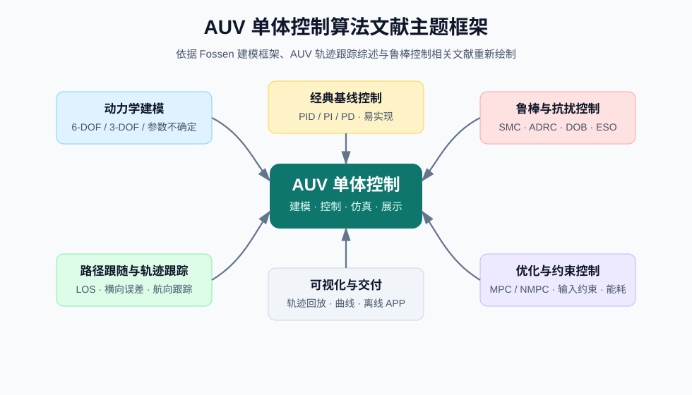
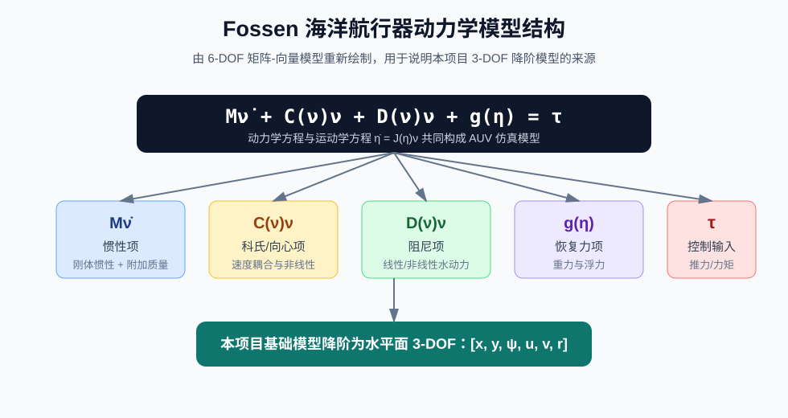
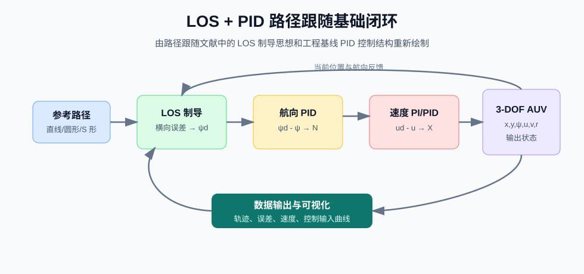
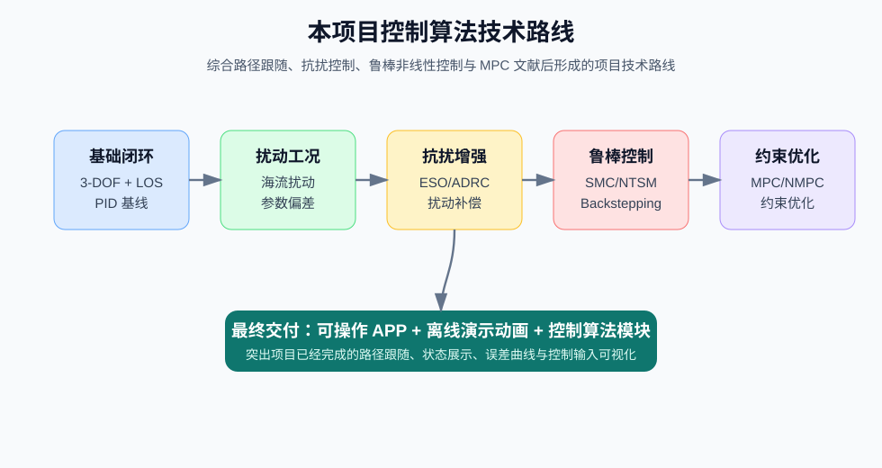

# AUV 单体控制算法模块及可视化项目文献综述

## 摘要

自主式水下航行器（Autonomous Underwater Vehicle, AUV）能够在海洋环境中完成巡检、测绘、搜寻、监测和工程作业等任务，其运动控制能力直接决定任务执行的稳定性、精度和可展示性。围绕 AUV 单体控制算法，已有研究主要集中在动力学建模、路径跟随、轨迹跟踪、抗扰控制、模型不确定补偿、输入约束处理以及仿真验证等方向。本项目面向“ AUV 单体控制算法模块及可视化”这一横向项目需求，目标并非进行纯科研意义上的最优算法对比，而是构建一个可运行、可复现、可展示的 AUV 单体控制仿真系统。因此，文献综述需要服务于项目方案论证：一方面明确 AUV 控制问题的理论基础和技术难点，另一方面解释为什么项目基础方案采用水平面 3-DOF 欠驱动模型、LOS 路径跟随和 PID 基线控制器，并在此基础上预留 ADRC/ESO、SMC、Backstepping、MPC/NMPC 等后续扩展路线。

根据已有调研文献，Fossen 的海洋航行器动力学建模框架为 AUV 控制提供了统一的矩阵—向量表达形式，是开展仿真建模和控制算法设计的重要理论基础。近年来 AUV 轨迹跟踪和路径跟随研究进一步关注模型不确定、海流扰动、执行器饱和、欠驱动约束和计算复杂度等工程问题。经典 PID 控制结构简单、易于部署，适合作为工程基线；LOS 制导能够将路径误差转化为期望航向，是 AUV 路径跟随任务中常用且可解释性较强的方法；滑模控制、反步控制、自适应控制和扰动观测器能够增强系统鲁棒性；MPC/NMPC 能够显式处理输入、状态和能耗约束，但对模型精度和在线求解能力要求较高。综合文献和项目约束，本项目宜采用“先建立稳定基础闭环，再逐步增强抗扰和高级控制能力”的技术路线。

关键词：AUV；单体控制；动力学建模；路径跟随；LOS 制导；PID 控制；鲁棒控制；MPC；可视化仿真

> 说明：本文中的示意图均为依据参考文献中的模型结构、控制框架和项目实施路线重新绘制的综述图，用于辅助说明文献逻辑和本项目方案，不直接复制原文献图片。

---

## 1. 研究背景与项目定位

AUV 是典型的强非线性、强耦合、受扰动、参数不确定的海洋机器人系统。与陆地移动机器人或空中飞行器相比，AUV 所处的水下环境具有明显特殊性：水动力参数难以准确获得，外部海流和湍流扰动难以直接测量，通信条件受限，定位和感知信息也可能存在延迟和噪声。因此，AUV 控制系统不仅需要完成基本的航向、速度、深度或路径跟随任务，还需要具有一定的鲁棒性和工程可实现性。

从任务角度看，AUV 单体控制通常包括定点保持、航向控制、深度控制、路径跟随和轨迹跟踪等问题。其中，路径跟随和轨迹跟踪最能体现 AUV 在水下执行任务的能力。路径跟随强调航行器沿给定几何路径运动，不一定严格要求在某一时刻到达路径上的指定点；轨迹跟踪则通常包含时间参数化要求，即航行器需要在规定时间到达规定位置。对于本项目而言，当前目标是构建以仿真和展示为主的 AUV 单体控制算法模块，在未知具体几何和惯性参数的情况下，优先完成可解释、可运行、可视化效果清晰的路径跟随仿真。因此，基础方案更适合从路径跟随入手，而不是直接做完整的高精度轨迹跟踪或复杂三维控制。

已有文献表明，AUV 控制研究大体可以分为几类：第一类是建模基础和控制问题综述，例如 Fossen 的海洋航行器动力学模型以及 Li 等关于 AUV 轨迹跟踪模型和控制策略的综述；第二类是传统控制和工程基线方法，包括 PID、PD、LQR 等；第三类是非线性和鲁棒控制方法，包括滑模控制、终端滑模、反步控制、自适应控制等；第四类是扰动观测与自抗扰方法，包括 DOB、ESO、ADRC 等；第五类是优化和约束控制方法，包括 MPC、NMPC、Tube-based MPC 等；第六类是复合或智能增强方法，如 MPC-SMC、GP-MPC、模糊 LOS 和模糊滑模等。

本项目不是单纯为了提出某一种新控制律，而是为了形成“控制算法模块 + 仿真运行 + 可视化展示”的完整交付。因此，文献综述的重点应落在以下问题上：AUV 的动力学模型应该如何建立？在参数未知时如何选择合适的简化模型？路径跟随和轨迹跟踪有什么区别？为什么基础方案可以采用 LOS + PID 作为基础闭环？后续如何根据文献扩展到抗扰控制、滑模控制和 MPC？可视化展示应如何服务于控制算法模块的验收和甲方理解？



图 1 将本项目相关文献归纳为建模基础、路径跟随与轨迹跟踪、经典基线控制、鲁棒与抗扰控制、优化约束控制以及可视化交付六类主题。后续各节将围绕这些主题展开，并说明它们如何共同支撑本项目的实施路线。

---

## 2. AUV 动力学建模研究综述

AUV 控制算法设计首先依赖于合理的动力学模型。Fossen 的海洋航行器建模框架是该领域最常用的理论基础之一。该框架将海洋航行器的六自由度运动统一写为矩阵—向量形式：

$$
\dot{\eta}=J(\eta)\nu
$$

$$
M\dot{\nu}+C(\nu)\nu+D(\nu)\nu+g(\eta)=\tau
$$

其中，$\eta$ 表示惯性坐标系下的位置和姿态，$\nu$ 表示体坐标系下的线速度和角速度，$M$ 为惯性矩阵，包含刚体惯性和附加质量，$C(\nu)$ 为科氏和向心矩阵，$D(\nu)$ 为水动力阻尼矩阵，$g(\eta)$ 为重力和浮力恢复项，$\tau$ 为推进器或舵面产生的广义控制力。该模型的价值不只是给出运动方程，更重要的是清楚地区分了 AUV 运动中的各类物理因素，使后续控制器设计、稳定性分析和仿真实现具有统一依据。



图 2 对 Fossen 矩阵—向量模型进行了重新绘制。该图强调完整模型由惯性、科氏/向心、水动力阻尼、恢复力和控制输入等部分组成，而本项目基础模型从该框架中降阶得到水平面 3-DOF 模型。

Fossen 模型对本项目的启发主要体现在三个方面。第一，它说明 AUV 控制问题不能脱离水动力模型讨论，即使当前方案只采用简化模型，也需要明确简化模型从完整 6-DOF 框架中降阶而来。第二，Fossen 模型揭示了 AUV 控制的主要困难，包括附加质量、非线性阻尼、速度耦合、恢复力和外部扰动等。第三，该模型结构支持多层级建模：完整 6-DOF 可用于理论说明和高保真扩展，水平面 3-DOF 可用于路径跟随和航向控制，垂向面模型可用于深度和俯仰控制，单通道模型可用于 PID、ADRC 或 SMC 的基础验证。

在工程实现层面，AUV 的几何、惯性和水动力参数往往难以完整获得。即使有公开文献参数，也很难保证与具体艇体一致。水动力参数还会随航速、姿态、雷诺数、附体结构和舵面状态变化。因此，直接实现完整 6-DOF 模型并不一定适合项目基础方案。完整模型虽然理论上更全面，但需要大量难以确认的参数，调试难度较高，容易导致仿真发散或控制器行为不可解释。

因此，许多文献和工程项目会根据任务需求采用降阶模型。对于水平面路径跟随任务，常用状态为 $[x,y,\psi,u,v,r]$，其中 $x,y$ 为水平位置，$\psi$ 为偏航角，$u,v$ 为体坐标系纵向和横向速度，$r$ 为偏航角速度。对应的水平面 3-DOF 模型能够保留 AUV 在水平面中的横荡、纵荡和偏航耦合，又避免了完整三维姿态和深度方向建模的复杂性。对于本项目基础方案，以水平面 3-DOF 模型作为主控模型是合理的：它既能体现 AUV 欠驱动路径跟随的核心问题，又能在参数未知条件下保持仿真可控性和展示稳定性。

欠驱动特性也是 AUV 建模中的重要问题。常见鱼雷型 AUV 通常通过主推进器控制纵向速度，通过舵面或等效偏航力矩控制航向，而不具备直接横向力控制能力。因此，水平面控制输入可表示为 $\tau_h=[X,0,N]^T$，其中 $X$ 为纵向推力，$N$ 为偏航力矩，横向力 $Y$ 固定为 0。这种建模方式比全驱动模型更接近常见 AUV，也更能体现 LOS 路径跟随和航向控制的意义。

海流扰动建模也是文献和项目实现中的关键点。简单地将海流作为外力直接叠加到控制输入上，虽然实现容易，但物理解释不够准确。更合理的方式是将惯性系海流转换到体坐标系，并使用 AUV 相对于水体的相对速度计算阻尼项。这样可以避免 AUV 转向后海流方向处理错误的问题。本项目已有方案中采用相对速度思想，将恒定海流纳入阻尼计算，是符合 Fossen 框架和工程直觉的处理方式。

综上，AUV 建模文献为本项目提供了清晰的建模层级：报告和理论说明中保留完整 Fossen 6-DOF 模型，代码实现采用水平面 3-DOF 欠驱动模型，后续根据需要扩展深度控制、垂向面模型或完整 6-DOF 模型。这种层级化建模策略兼顾理论完整性和工程可实现性。

---

## 3. 路径跟随与轨迹跟踪研究现状

路径跟随和轨迹跟踪是 AUV 单体运动控制中的核心任务。Li 等关于 AUV 轨迹跟踪模型与控制策略的综述指出，AUV 轨迹跟踪研究长期面临模型不确定、未知扰动、控制输入受限和水下环境复杂等问题。He 等针对 AUV 路径跟随、轨迹跟踪和编队控制的综述进一步说明，近年来研究逐渐从单纯的轨迹误差收敛扩展到鲁棒性、约束处理、能耗、复杂海流和工程部署等方面。

路径跟随与轨迹跟踪的区别对本项目尤其重要。轨迹跟踪通常给定时间参数化参考轨迹，要求 AUV 在时间 $t$ 到达参考点 $p_d(t)$，因此控制器不仅要控制几何路径误差，还要控制时间同步误差。路径跟随则更关注 AUV 是否沿给定几何路径运动，并不强制要求某一时刻到达路径上的特定点。对于缺少真实艇体参数、以展示仿真为主的项目，路径跟随比轨迹跟踪更适合作为基础路径跟随任务，因为它对时间同步和模型精度的要求较低，更容易形成稳定闭环。

LOS（Line-of-Sight）制导是 AUV 路径跟随中常见的方法。其基本思想是根据当前 AUV 位置、参考路径和横向误差，计算一个期望航向角 $\psi_d$，再由航向控制器跟踪该期望航向。LOS 的优点在于结构清晰、物理意义直观、参数较少、便于可视化解释。对于直线路径，LOS 可将横向误差通过前视距离转换为航向修正量；对于圆形或 S 形路径，可通过最近路径点、路径切向方向或前视点生成期望航向。文献中还出现了模糊 LOS、LOS 重规划等改进形式，用于处理海流扰动、路径曲率变化和输入约束等问题。

本项目基础方案采用 LOS + PID 是合理的。LOS 负责把路径跟随问题转化为航向跟踪问题，PID 负责航向闭环控制，速度控制器负责保持期望纵向速度。这样形成的基础闭环为：参考路径 → LOS 期望航向 → 航向 PID → AUV 动力学 → 实际轨迹 → 横向误差评价。该结构虽然不是最先进的控制方案，但具有很强的工程解释性和展示价值。甲方在可视化界面中可以直接看到参考路径、实际轨迹、当前 AUV 位置、横向误差曲线、航向误差曲线和控制输入曲线，从而理解“控制算法模块已经能够使 AUV 沿给定路径运动”。



图 3 展示了基础仿真闭环的核心逻辑：参考路径经过 LOS 制导生成期望航向，航向 PID 和速度控制器分别产生偏航力矩与纵向推力，AUV 3-DOF 模型输出状态，再由数据记录和可视化模块展示轨迹与误差。

对于路径类型，文献和项目方案均表明应从简单到复杂逐步验证。直线路径用于验证符号、坐标系、航向误差 wrap 和 PID 收敛；圆形路径用于验证曲率路径跟随能力；S 形路径用于验证连续机动路径下的控制稳定性。如果直线路径还不能稳定收敛，就不应进入圆形或 S 形路径调试。这样的逐步验证策略对于工程项目非常重要，因为 AUV 控制中常见错误包括坐标系方向反、横向误差符号错误、航向角跳变、控制输入饱和和 LOS 前视距离设置不合理等。

因此，路径跟随文献对本项目的主要贡献是提供了一个低风险、高可解释性的基础技术路线。项目不必一开始追求复杂三维轨迹跟踪，而应先把水平面路径跟随闭环做稳定，再将后续鲁棒控制和高级控制作为增强模块逐步加入。

---

## 4. 经典控制与 PID 基线方法

PID 控制是工程控制中最常用的基础方法之一。在 AUV 控制中，PID 常用于航向、深度、速度等单通道或弱耦合控制任务。虽然 PID 难以直接处理强非线性、强耦合和复杂约束，但其结构简单、参数含义明确、计算量小、实现可靠，非常适合作为工程基线控制器。多个综述类文献均指出，PID、PD、LQR 等传统控制方法虽然理论创新性有限，但由于部署简单和实时性强，在实际系统中仍具有重要地位。

本项目中的 PID 主要用于两个位置：纵向速度控制和航向控制。纵向速度控制可以根据期望速度 $u_d$ 和实际速度 $u$ 计算纵向推力 $X$；航向控制可以根据 LOS 输出的期望航向 $\psi_d$ 和实际航向 $\psi$ 计算偏航力矩 $N$。其中，航向误差必须进行角度归一化，即 wrap 到 $[-\pi,\pi]$，否则当角度跨越 $\pi$ 或 $-\pi$ 时会产生错误的大幅控制输入。

PID 控制器在工程实现中还必须考虑执行器限幅和积分饱和。AUV 推进器和舵面不可能输出无限大的力或力矩，因此控制输入需要限幅。如果积分项在执行器饱和时继续累积，会导致 anti-windup 问题，使系统恢复变慢甚至产生超调。因此，本项目在 PID 模块中加入输出限幅和积分限幅是必要的。这些内容虽然属于工程细节，但对于可运行仿真和展示稳定性非常关键。

将 PID 作为基线并不意味着项目技术含量不足。恰恰相反，基线控制器是后续算法对比和系统扩展的基础。如果没有稳定的 LOS + PID 闭环，就很难判断后续 ADRC、SMC 或 MPC 的改进是否真实有效。对于横向项目而言，基础方案最重要的是可运行、可解释、可复现，而不是堆叠复杂算法。PID 基线能够帮助项目建立“可用的基础控制模块”，并为后续版本提供统一对照。

当然，PID 的局限也必须在综述中明确说明。AUV 的非线性水动力、参数不确定、外部海流和欠驱动约束会使 PID 在复杂工况下性能下降。对于强海流、参数偏差或复杂曲线路径，PID 可能出现较大的稳态误差、控制输入饱和或响应变慢。因此，后续需要引入扰动观测、鲁棒控制或优化控制方法，以提高抗扰能力和约束处理能力。

---

## 5. 自适应控制与扰动观测方法

AUV 模型参数不确定是文献中反复强调的问题。Sahu 与 Subudhi 的自适应跟踪控制研究针对水动力参数不确定条件下的 AUV 轨迹跟踪问题，利用状态相关回归矩阵设计自适应控制律，并通过 Lyapunov 方法证明稳定性。Guerrero 等关于 AUV 自适应轨迹跟踪的研究也关注参数不确定和误差收敛问题。这类方法的核心思想是在线估计未知参数或调整控制律，使系统在模型不完全准确时仍能保持较好的跟踪性能。

自适应控制的优点是能够处理一定范围内的模型参数不确定，特别适用于水动力参数难以准确获取的 AUV 系统。但其局限也比较明显：自适应律通常依赖模型结构，参数收敛需要激励条件，对突变扰动、执行器饱和和复杂约束的处理能力有限。此外，自适应控制器的推导和实现复杂度高于 PID，对工程调试要求也更高。

扰动观测器方法则从另一个角度处理不确定性。Guerrero 等关于自适应扰动观测器的研究表明，可以将未知外部扰动、未建模动力学和参数偏差合并为总扰动，通过观测器进行估计并在控制律中补偿。类似思想也出现在 DOB、ESO 和 ADRC 中。对于 AUV 而言，海流扰动、阻尼参数误差、推进器效率变化等都可以在一定程度上被视为总扰动。

扰动观测器对本项目具有较高工程价值。因为本项目已经建立了 LOS + PID 基础闭环，后续可以较自然地在航向通道加入 ESO 或 ADRC。可以先从单通道航向模型入手，例如：

$$
I_z\dot{r}+d_r r=N+d
$$

其中 $d$ 表示总扰动。ESO 估计该扰动后，在控制输入中进行补偿。这样可以形成 PID 与 ADRC 的可视化对比：在同样海流或参数偏差条件下，观察横向误差、航向误差和控制输入变化。

从项目实施角度看，扰动观测器方法适合作为抗扰增强模块，而不是基础闭环的核心。原因是应先确保模型、坐标系、LOS、PID、数据输出和可视化都稳定；在此基础上加入 ESO/ADRC 才能清楚展示“抗扰能力增强”。如果一开始就引入多通道观测器，会增加调试难度，且难以区分问题来自基础模型还是观测器参数。

---

## 6. 滑模控制、终端滑模与反步控制

滑模控制（Sliding Mode Control, SMC）是 AUV 鲁棒控制文献中非常常见的方法。其基本思想是设计滑模面，使系统状态在有限时间内到达并保持在该滑模面附近，从而对匹配扰动和模型不确定性具有较强鲁棒性。Qiao 与 Zhang 的双环积分终端滑模控制、Zhang 等的 NTSM-ADRDC、Wang 与 Du 的非奇异快速终端滑模控制等文献都属于这一方向。

滑模控制的优势在于鲁棒性强、收敛速度快，适合处理 AUV 非线性和外部扰动问题。终端滑模和非奇异快速终端滑模进一步改善了收敛速度和奇异性问题，能够在理论上获得更快的误差收敛。对于欠驱动 AUV 水平面轨迹跟踪，终端滑模方法常通过构造期望速度或误差转换关系，将欠驱动约束下的跟踪问题转化为可控制的误差系统。

但滑模控制也存在工程问题。最典型的是抖振，即控制输入出现高频切换。对于真实 AUV，频繁高频控制会增加执行器磨损和能耗，也可能超出舵面或推进器响应能力。因此，工程实现中通常不用理想 sign 函数，而采用 sat 函数、tanh 函数或边界层方法降低抖振。本项目后续若实现 SMC，应明确采用边界层处理，并在可视化中展示控制输入曲线是否平滑。

反步控制（Backstepping）也是 AUV 非线性控制中的重要方法，尤其适用于欠驱动系统。反步控制通常从运动学误差出发，逐步构造虚拟控制量和实际控制输入。文献中常见路线是 LOS 制导提供路径误差信息，Backstepping 设计运动学控制器，再结合 SMC 或 NDO 处理动力学不确定和外部扰动。2024 年关于海流观测器、NDO、Backstepping 和积分滑模的三维路径跟随研究就是这一复合路线的典型代表。

Backstepping + SMC + DOB/NDO 的组合对本项目具有较强参考价值。它对应的技术路线可以简化为：LOS guidance → Backstepping kinematic control → SMC/NTSM dynamic control → DOB/ESO disturbance compensation。该路线能够体现较完整的 AUV 单体控制算法模块能力，但实现难度明显高于 LOS + PID 基础闭环。因此，更适合作为后续主算法扩展，而不是当前基础方案的验收内容。

从横向项目展示角度看，滑模和反步控制的价值在于“增强版控制能力展示”。基础展示系统先体现基本路径跟随能力；抗扰增强模块展示在海流或参数偏差下 ADRC/ESO 的补偿效果；鲁棒非线性控制模块再展示 SMC/Backstepping 对收敛速度和稳态偏差的改善。这样既符合文献技术路线，也符合工程项目逐步交付和演示的逻辑。

---

## 7. MPC/NMPC 与约束控制方法

MPC 和 NMPC 是近年来 AUV 轨迹跟踪和路径跟随研究中的重要方向。与 PID、SMC 等方法相比，MPC 的主要优势在于能够显式处理输入约束、状态约束、避障约束和能耗目标。Zhang 等的 MPC-based 3D trajectory tracking、Heshmati-Alamdari 等的鲁棒 NMPC、Jimoh 等的 Tube-based MPC with LOS re-planning，以及 Lyapunov-based MPC 等文献都体现了这一趋势。

AUV 控制中存在多类约束：推进器推力有限，舵角或偏航力矩有限，航速不能无限增大，姿态变化可能受安全边界限制，能耗也常常是水下长期任务的重要指标。传统 PID 或 SMC 可以通过限幅处理输入约束，但难以在控制律设计中系统地考虑未来轨迹、状态边界和能耗优化。MPC 将控制问题转化为滚动优化问题，因此在约束处理方面具有天然优势。

Tube-based MPC 进一步面向不确定环境和未知扰动，通过名义轨迹和误差管设计增强鲁棒性。Jimoh 等的研究还将 LOS 重规划与 Tube-based MPC 结合，用于处理输入饱和、未知扰动和能耗指标。这类方法对复杂海况下的高性能 AUV 控制具有重要意义，也适合作为项目后续高级扩展方向。

然而，MPC/NMPC 的工程实现成本较高。首先，它依赖较准确的预测模型；其次，需要在线求解优化问题，对计算资源和实时性有要求；再次，参数整定、约束设置和求解器稳定性都需要较多工程经验。在本项目当前缺少真实 AUV 几何和水动力参数的情况下，直接将 MPC 作为基础控制器并不合适。更合理的做法是预留 MPC 接口，先不实现完整 MPC；待基础闭环、数据输出和可视化稳定后，再将 MPC 作为高级约束控制模块扩展。

MPC 相关文献仍然对本项目有重要意义。它们提示项目后续可以加入执行器饱和比例、控制输入峰值、能耗近似指标等展示内容。这些指标不仅服务于算法评估，也能让甲方更直观地理解控制模块的工程意义：不仅要让 AUV 跟上路径，还要控制输入合理、不过度饱和、能耗可解释。

---

## 8. 复合控制与智能增强方向

近年 AUV 控制研究中，单一控制方法逐渐向复合控制框架发展。例如 Hong 等提出的 State-Transform MPC-SMC 方法，将状态变换、MPC 和 SMC 结合，用于交叉舵 AUV 的轨迹跟踪任务；Bao 与 Zhu 将 CFD 数据建模、MPC 和动态滑模控制结合；Zhang 等将 NTSM 和 ADRDC 结合，用于三维 AUV 轨迹跟踪；FLOS + FSMC 方法则将模糊 LOS 和模糊滑模结合，用于改善海流扰动下的路径跟随性能。

复合控制的主要动机是弥补单一方法的不足。MPC 擅长约束和优化，但对模型依赖强、计算量大；SMC 鲁棒性强，但可能抖振；ADRC/ESO 擅长估计总扰动，但参数带宽和噪声敏感性需要处理；模糊控制可进行经验调参，但理论可解释性相对弱。将这些方法组合起来，可以在一定程度上兼顾约束处理、鲁棒性、抗扰能力和工程可调性。

智能增强方法如 GP-MPC 则尝试利用高斯过程等学习方法补偿模型不确定性，并与 MPC 结合完成轨迹跟踪和避障。这类方法代表了未来趋势，但对训练数据、计算资源和稳定性验证要求较高。对于本项目而言，智能增强控制不宜作为近期主线，但可以在综述和后续展望中作为扩展方向。

复合控制文献对本项目的启发是：最终项目不必局限在 LOS + PID，也不必一次性跳到复杂 NMPC。更合适的路线是分层增强。第一层是基础路径跟随闭环，即 3-DOF + LOS + PID；第二层是抗扰补偿，即 PID + ESO/ADRC 或 PID + DOB；第三层是鲁棒非线性控制，即 LOS + Backstepping + SMC/NTSM；第四层是约束优化，即 MPC/NMPC 或 MPC-SMC。这样的路线既有文献依据，又符合工程实现和展示节奏。

---

## 9. 可视化展示与仿真验证需求

本项目与纯算法论文的一个重要区别在于，它最终需要形成可操作 APP 和演示动画。因此，文献综述不仅要讨论控制算法，还要回应“如何展示项目做到的事情”。AUV 控制文献通常通过轨迹图、误差曲线、控制输入曲线、速度曲线和统计指标展示算法性能。这些展示方式也应成为本项目可视化模块的基础。

对于 LOS + PID 路径跟随基础方案，最关键的展示内容包括参考路径与实际轨迹、当前 AUV 位置和航向、横向误差曲线、航向误差曲线、速度曲线和控制输入曲线。参考路径与实际轨迹能够直观说明 AUV 是否沿路径运动；横向误差体现路径跟随效果；航向误差体现 LOS 期望航向和航向控制器的跟踪情况；速度曲线体现纵向速度控制效果；控制输入曲线体现推力和偏航力矩是否平稳、是否达到饱和。

对于横向项目展示，应避免把界面做成科研论文式的复杂对比堆叠。甲方更关心系统是否完成合同所写的能力，即 AUV 单体控制算法模块及可视化是否可运行、可操作、可展示。因此，可视化 APP 应突出“当前场景、控制器、运行状态、轨迹回放、当前状态、关键指标、是否达标”等信息，而不是展示过多理论解释。项目当前已按这一方向对界面进行简化，是符合交付展示需求的。

文献中的评价指标也需要结合项目实际筛选。科研论文常使用 RMS 误差、最大误差、稳态误差、能耗、控制输入平滑性等指标。但在甲方演示中，过多指标可能造成理解负担。可以保留更直观的最大横向误差、稳态误差、控制输入峰值、饱和比例和是否达标等指标；RMS 指标如用户不希望展示，也可以从界面中删除，但在内部测试或报告中仍可保留作为技术评价依据。

因此，文献验证方式对项目的启发是：仿真系统要能输出标准化数据，前端要能将这些数据转化为直观展示。控制算法模块和可视化模块不是分离的，控制算法输出的状态、误差和控制输入正是可视化展示的核心内容。

---

## 10. 文献对本项目技术路线的支撑

综合已有文献，本项目当前采用的基础路线具有充分依据。首先，Fossen 模型为项目提供了动力学建模理论基础；其次，路径跟随和轨迹跟踪综述说明 AUV 控制的主要难点是模型不确定、外部扰动、非线性和约束；再次，LOS 制导是路径跟随中常用且可解释性强的方法；最后，PID 虽然简单，但适合作为工程基线和基础控制器。

项目当前约束是缺少具体 AUV 的几何、惯性和水动力参数。因此，如果直接追求完整 6-DOF、Backstepping + SMC + DOB 或 NMPC，容易出现周期过长、调试困难和展示不稳定的问题。文献虽然提供了许多高级方法，但这些方法往往需要更完整的模型参数、更复杂的推导和更严格的仿真条件。对于横向项目基础方案，稳定可展示比算法复杂度更重要。

推荐技术路线可以概括为：

```text
基础闭环：水平面 3-DOF 欠驱动模型 + LOS 路径跟随 + PID baseline
扰动工况：加入海流扰动、参数偏差和执行器饱和，形成可解释仿真场景
抗扰增强：加入 ESO/ADRC 或 DOB，展示抗扰增强
鲁棒控制：加入 SMC/NTSM 或 Backstepping，展示鲁棒非线性控制能力
约束优化：扩展 MPC/NMPC，展示约束优化和高级控制能力
展示交付：强化可视化 APP，形成离线可运行交付版本
```



图 4 将文献综述得到的控制算法路线转化为本项目的技术演进逻辑。该路线强调先完成稳定可展示的基础闭环，再逐步加入扰动、抗扰补偿、鲁棒非线性控制和 MPC/NMPC 约束优化。

该路线与文献发展脉络一致，也与项目交付目标一致。基础闭环不是研究终点，而是工程平台的基础。只要基础模型、控制器接口、数据输出和可视化结构设计合理，后续算法可以逐步替换或扩展，而不需要推翻整个项目。

---

## 11. 存在问题与后续研究方向

尽管当前文献调研已经覆盖 AUV 单体控制的主要方向，但仍存在一些需要后续补充的问题。

第一，当前项目尚未使用真实 AUV 参数。文献中的参数往往对应特定艇体、特定舵面和特定工况，不能简单照搬。后续如果需要提升仿真可信度，应寻找公开 AUV 参数集，或根据目标 AUV 的尺寸、质量、推进器和舵面信息建立近似参数。

第二，当前方案主要聚焦水平面路径跟随，尚未涉及深度控制和三维运动。对于完整 AUV 任务而言，深度和俯仰控制同样重要。后续可以在水平面模型稳定后加入垂向面模型，逐步扩展到 3D 路径跟随。

第三，当前控制器主要是 LOS + PID，抗扰能力有限。海流扰动较强或参数偏差较大时，PID 可能出现明显稳态误差。后续应优先加入 ESO/ADRC 或 DOB，再考虑 SMC、Backstepping 和 NTSM。

第四，当前可视化展示已经能够表现轨迹、误差、速度和控制输入，但仍可继续增强演示动画和交互操作。例如可以加入场景选择、参数调节、播放速度控制、离线演示模式和关键状态高亮。需要注意的是，展示界面应服务于甲方理解，不宜堆砌过多科研指标。

第五，如果未来项目需要强调“高性能控制”或“约束处理”，MPC/NMPC 是重要方向。但在引入 MPC 前，应先确保模型、输入限幅、状态定义和仿真接口规范化，否则优化控制器很难稳定工作。

---

## 12. 结论

本文基于已有 AUV 单体控制算法调研文献，对本项目所需的动力学建模、路径跟随、经典控制、鲁棒控制、扰动观测、MPC 约束控制和可视化展示进行了综述。总体来看，AUV 单体控制研究已经形成较完整的方法体系：Fossen 模型提供统一建模基础；LOS 制导和 PID 控制适合构建工程基线；自适应控制、DOB/ESO/ADRC 可处理参数不确定和外部扰动；SMC、终端滑模和 Backstepping 可增强非线性鲁棒控制能力；MPC/NMPC 可显式处理约束和能耗；复合控制和智能增强方法代表未来发展方向。

结合本项目“C++ 核心模块 + 仿真为主 + 可操作 APP 展示 + 参数未知”的实际约束，选择水平面 3-DOF 欠驱动 AUV、LOS 路径跟随和 PID baseline 作为基础方案是合理且稳妥的。该方案能够在较低实现风险下形成完整闭环，并通过可视化界面清楚展示 AUV 沿直线、圆形和 S 形路径运动的能力。后续可在该基础上逐步加入海流扰动、参数偏差、执行器饱和、ADRC/ESO、SMC/Backstepping 和 MPC/NMPC，从而形成由基础控制到鲁棒控制、再到高级约束控制的可扩展技术路线。

因此，本项目的文献综述结论可以概括为：项目应先强调“做稳基础闭环”，再强调“增强抗扰能力和高级控制能力”；可视化模块应突出系统已经具备的控制仿真与演示能力，而不是过度追求科研式指标堆叠。这样的路线既符合 AUV 控制文献的发展规律，也符合横向项目交付展示的实际需求。

---

## 参考文献

[1] Thor I. Fossen. *Handbook of Marine Craft Hydrodynamics and Motion Control*. Wiley, 2nd Edition, 2021.

[2] Fossen Marine Craft Model. https://fossen.biz/html/marineCraftModel.html

[3] Thor I. Fossen, Ola-Erik Fjellstad. Nonlinear Modelling of Marine Vehicles in 6 Degrees of Freedom. *Journal of Mathematical Modelling of Systems*, 1995.

[4] Li et al. AUV Trajectory Tracking Models and Control Strategies. 2021.

[5] He et al. A Review of Path Following, Trajectory Tracking, and Formation Control for AUVs. 2025.

[6] Eissa et al. Trajectory tracking control of AUVs: a PRISMA-guided review. 2025/2026.

[7] Sahu and Subudhi. Adaptive Tracking Control of an Autonomous Underwater Vehicle. 2014.

[8] Guerrero et al. Trajectory tracking for AUV: An adaptive approach. 2019.

[9] Guerrero et al. Adaptive disturbance observer for trajectory tracking control of underwater vehicles. 2020.

[10] Qiao and Zhang. Double-loop integral terminal sliding mode tracking control for UUVs. 2019.

[11] Heshmati-Alamdari et al. Robust Trajectory Tracking Control for Underactuated AUVs in Uncertain Environments. 2020/2021.

[12] Zhang et al. MPC-based 3-D trajectory tracking for an AUV with constraints in complex ocean environments. 2019.

[13] Bao and Zhu. Modeling and trajectory tracking MPC novel method of AUV based on CFD data. 2022.

[14] Zhang et al. 3D Trajectory Tracking of AUV Based on NTSM and ADRDC. 2023.

[15] Hong et al. State-Transform MPC-SMC-Based Trajectory Tracking Control of Cross-Rudder AUV. 2024.

[16] Liu et al. GP-MPC for Trajectory Tracking and Obstacle Avoidance in AUVs. 2024.

[17] Jimoh et al. Tube-based MPC of an AUV using LOS re-planning. 2024.

[18] Ebrahimpour et al. Finite-Time Path-Following Control of Underactuated AUVs. 2025.

[19] Three-Dimensional Path Following Control for Underactuated AUVs Based on Current Observer and NDO. 2024.

[20] FLOS + FSMC path-following control for AUVs considering multiple factors. 2024.

[21] Wang and Du. Trajectory Tracking Control for an Underactuated AUV via Nonsingular Fast Terminal Sliding Mode. 2024.


